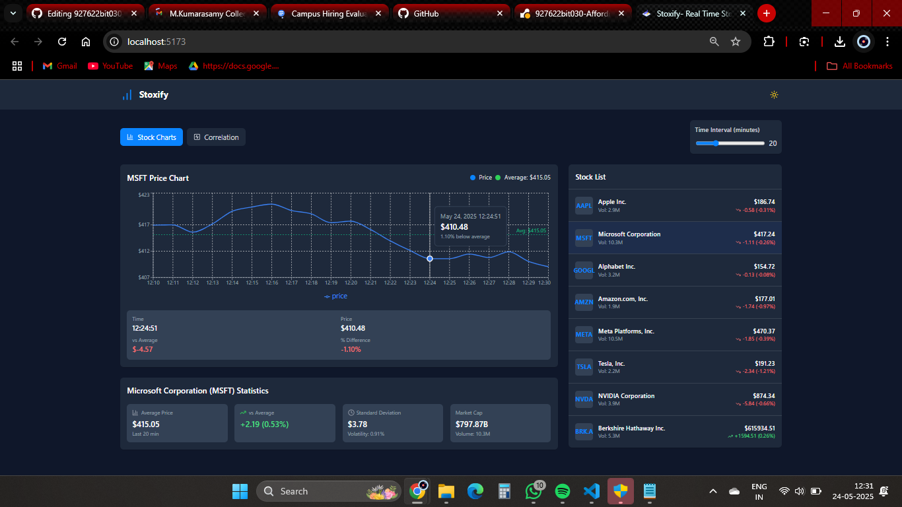
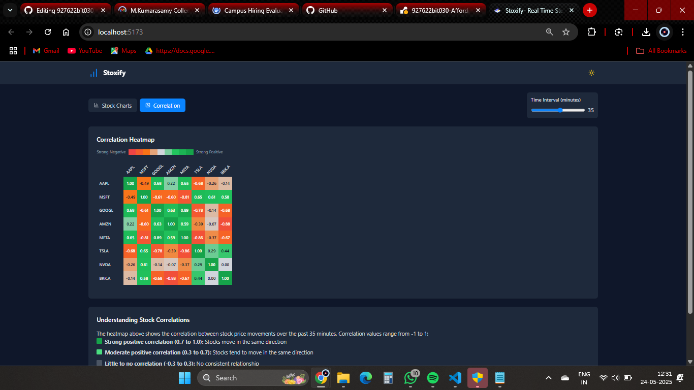

# 📈 Stoxify - Real-Time Stock Aggregation Dashboard Question -1

  

> 🔥 A full stack stock dashboard that shows real-time stock trends, price statistics, and visualizes market activity in a smooth, interactive UI.

---
 Watch Full live => 🚀[live](https://stoxiffy.onrender.com/)
## 🚀 Features

- 📊 Real-time Stock Chart with Vite + React
- 🧮 Backend with API endpoints
- 🔁 Dynamic data updates using Fetch
- 📋 Detailed Stock Stats (Price, Volatility, Market Cap)
- 💡 Clean UI with Tab-based Navigation (Stock Charts / Correlation)
- 🌐 Fully responsive & modern design

---

## 📸 Screenshots

| Dashboard View | Correlation View |
|----------------|----------|
|  |  |

---

## 🧰 Tech Stack

| Frontend | Backend |
|----------|---------|
| React (Vite) |
| TypeScript  |
| Recharts | REST APIs |
| CSS Modules | JSON In-Memory DB |

